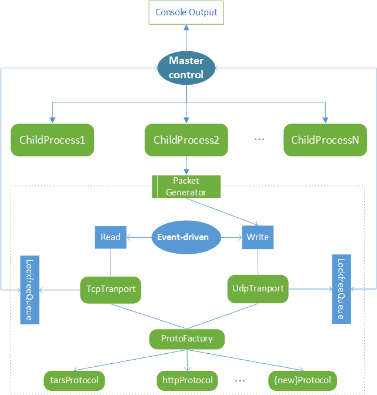

## Introduction

[tb(tars benchmark)](https://github.com/TarsCloud/TarsBenchmark) It is a non-code benchmark tool specially tailored for tars service, with the following features:

 - High performance: 8-core machine TPS supports more than 20W/s;
 - Network compatibility: The network layer supports TCP and UDP protocol;
 - Protocol scalability: It supports http/tars service benchmark, open to third-protocol agreements
 - Perfect real-time monitor. Provide the number of TPS/Success Rate/Cost time within the cycle;

## Framework

The tb is designed in a multi-process model. The main process is responsible for resource scheduling and display, and the benchmark process is responsible for network transmission and reception and statistics. The network layer can flexibly choose TCP or UDP; adopts a protocol factory to manage various service protocols, supports http/tars by default; the main process and the benchmark process exchange signals through control information, and the data interacts through the lock-free shared memory queue to achieve the lowest resource consumption. The main process periodically collects each The network statistics of the benchmark process are output to the console after a simple summary.




## Usage

Sample
```text
./tb -c 600 -s 6000 -D 192.168.31.1 -P 10505 -p tars -S tars.DemoServer.DemoObj -M test -C test.txt
```
参数说明
```text
  -h                   Help infomation
  -c                   Number of connections
  -D                   Target server address(ipv4)
  -P                   Target server port
  -p                   Service protocol(tars|http)
  -t(optional)         Overtime time，default 3 second
  -T(optional)         Network protocol，default tcp
  -I(optional)         Continue time(by second)，default 1h
  -i(optional)         View interval(by second)，default 10s
  -s(optional)         Maximum tps limit per target server
  -n(optional)         Maximum process
```
See details in [develop.md](develop.md)

