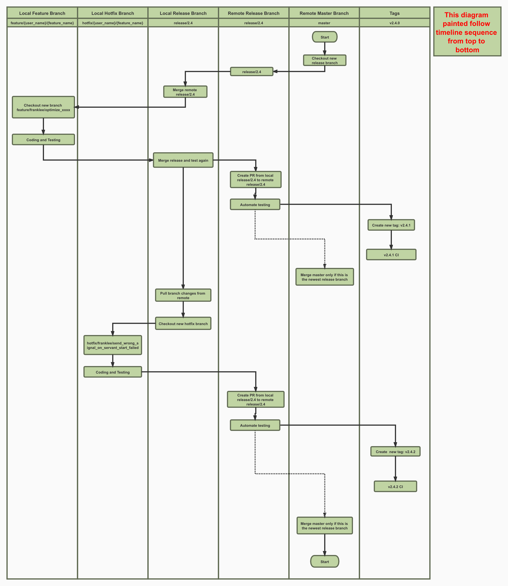

# TarsFramework GitHub Cooperation Rules

## Introduction

[TarsFramework](https://github.com/TarsCloud/TarsFramework) integrated several services like TarsRegistry,TarsNode,TarsProperty etc. The services were built by [TarsCpp](https://github.com/TarsCloud/TarsCpp). [TarsProtocol](https://github.com/TarsCloud/TarsProtocol) is a shared submodule of TarsCpp and some other Tars repositories. [TarsWeb](https://github.com/TarsCloud/TarsWeb) is a web tool that was built for TarsFramework management. We decided to choose v2.4 as the first Tars LTS version and build several versions rules those 4 related repositories. Just to make sure we could build better multi-version support here.

## Plan

We made a basic rule for version deploy. The new version of each repository must follow this rule. v`{main version number}`.`{subversion number}`.`{build number}`

- The first main version number is 2, the first subversion number is 4. Each compatible feature improvement and bug fix on this version will be considered as a build. For example, bugfix on v2.4.0 will trigger a v2.4.1 tag release.
- We will plan further versions like v2.5,v2.6. But we have to keep each version forward compatible. Highlight the changes in the release note if it's not.

### Rules

Everyone is welcomed to help us improve Tars on GitHub. Please read the following rules before you do anything.

1. Please fork the repository at first.
2. Branches like release/x.x is the master branch of each version. Do not send cross-version PR.
3. Please make sure your release is well updated to prevent further conflict.
4. Please checkout feature release from specific release branch, and follow the branch naming rule: feature/`{user_name}`/`{feature_name}`. For example, `feature/franklee/correct_error_message_on_property_table_missing`
5. Please checkout a hotfix branch if it's a hotfix. The naming rule for hotfix branch is: hotfix/`{user_name}`/`{bug_name}`. For example, `hotfix/franklee/fix_wrong_typing_on_servant_status_enum_define`
6. Please fully test your coding on a feature branch or hotfix branch.
7. Merge your feature branch and hotfix branch on your local release branch after you have done your work
8. Submit Pull Request to the release branch of Tars remote repository. Don't forget to write the necessary note.

Git Flow Diagram：

### Attention

1. Remote repository means repositories under TarsCloud organization like `TarsCloud/TarsFramework` in this document 
2. Remote branch means branches in the remote repository
3. Local repository is the repository you forked to your own repositories. (Not the repository in your computer)
4. Local branch is the branch in your local repository.
5. Please merge the latest release branch to master. Thus we could easily set up a new version branch.
6. Only checkout from the master branch if you are set up a new version branch.
7. Merge old version branch to master is prohibited.
