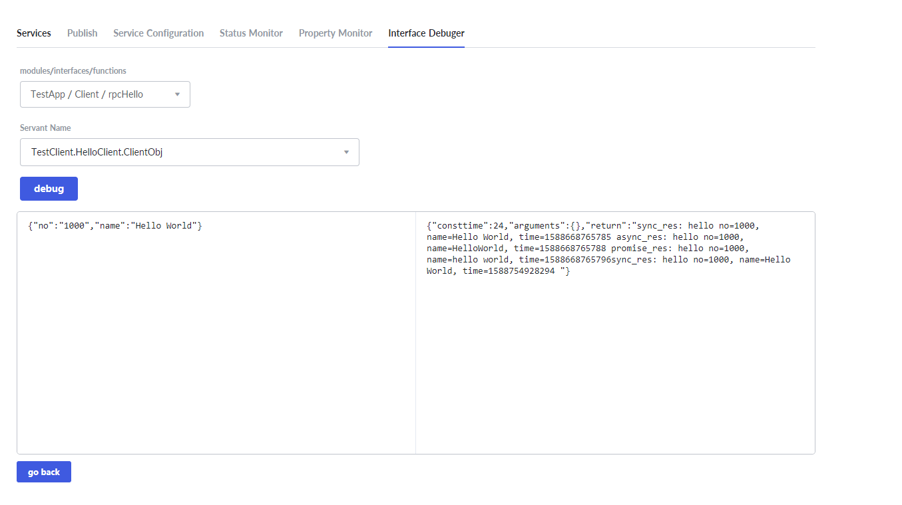

# Quick Start To Tars Client


## Tars deployment by Docker
If the Tars service has not been deployed, please refer to the deployment process in [tars-quick-start-server](./tars-quick-start-server.md).


## Client development

### Environmental requirements

- JDK1.8 or above
- Maven 2.2.1 or above
- Spring Boot 2.0 or above


### Project structure

```text
├── pom.xml
└── src
   └── main
       ├── java
       │   └── tars
       │       └── testapp
       │          ├── HelloPrx.java
       │          ├── HelloPrxCallback.java
       │          ├── App.java
       │          └── impl
       │                └── ClientServantImpl.java
       └── resources
           ├── hello.tars
           └── client.tars
       
```


### Dependency configuration

The following configuration needs to be added in pom.xml:

**Spring boot and Tars framework dependency**

```xml
    <properties>
        <spring-boot.version>2.0.3.RELEASE</spring-boot.version>
    </properties>

    <dependencyManagement>
        <dependencies>
            <dependency>
                <groupId>org.springframework.boot</groupId>
                <artifactId>spring-boot-dependencies</artifactId>
                <version>${spring-boot.version}</version>
                <type>pom</type>
                <scope>import</scope>
            </dependency>
        </dependencies>
    </dependencyManagement>

    <dependencies>
        <dependency>
            <groupId>com.tencent.tars</groupId>
            <artifactId>tars-spring-boot-starter</artifactId>
            <version>1.7.0</version>
        </dependency>
    </dependencies>
```

**Plugin dependency**

```xml
<!--tars2java plugin-->
<plugin>
	<groupId>com.tencent.tars</groupId>
	<artifactId>tars-maven-plugin</artifactId>
	<version>1.7.0</version>
	<configuration>
		<tars2JavaConfig>
			<!-- tars文件位置 -->
			<tarsFiles>
				<tarsFile>${basedir}/src/main/resources/hello.tars</tarsFile>
			</tarsFiles>
			<!-- Source file encoding -->
			<tarsFileCharset>UTF-8</tarsFileCharset>
			<!-- Generate server code -->
			<servant>false</servant>
			<!-- Generated source code encoding -->
			<charset>UTF-8</charset>
			<!-- Generated source code directory -->
			<srcPath>${basedir}/src/main/java</srcPath>
			<!-- Generated source code package prefix -->
			<packagePrefixName>com.tencent.tars.client.</packagePrefixName>
		</tars2JavaConfig>
	</configuration>
</plugin>
<!--package plugin-->
<plugin>
    <groupId>org.apache.maven.plugins</groupId>
    <artifactId>maven-jar-plugin</artifactId>
     <version>2.6</version>
     <configuration>
         <archive>
             <manifestEntries>
                 <Class-Path>conf/</Class-Path>
             </manifestEntries>
          </archive>
     </configuration>
</plugin>
<plugin>
    <groupId>org.springframework.boot</groupId>
    <artifactId>spring-boot-maven-plugin</artifactId>
    <configuration>
        <!--set mainclass-->
        <mainClass>com.tencent.tars.App</mainClass>
    </configuration>
    <executions>
        <execution>
            <goals>
                <goal>repackage</goal>
             </goals>
     </executions>
</plugin>
```


### Service development

#### Server interface file compilation

Copy the hello.tars file on the server side to the resources directory, and execute `mvn tars: tars2java` in the project root directory to get HelloPrx.java. At this time, the proxy interface of the server service is obtained, and three calling methods are provided, namely synchronous call, asynchronous call and promise call.

```java
@Servant
public interface HelloPrx {

	 String hello(int no, String name);

	CompletableFuture<String>  promise_hello(int no, String name);

	 String hello(int no, String name, @TarsContext java.util.Map<String, String> ctx);

	 void async_hello(@TarsCallback HelloPrxCallback callback, int no, String name);

	 void async_hello(@TarsCallback HelloPrxCallback callback, int no, String name, @TarsContext java.util.Map<String, String> ctx);
}
```

#### Client interface file definition

Create a new client.tars file in the resources directory with the following content:

```text
module TestApp
{
	interface Client
	{
	    string rpcHello(int no, string name);
	};
};
```

#### Client interface file compilation

Modify the tars2java plugin dependency of pom.xml:

```xml
<!--tars2java plugin-->
<plugin>
	<groupId>com.tencent.tars</groupId>
	<artifactId>tars-maven-plugin</artifactId>
	<version>1.7.0</version>
	<configuration>
		<tars2JavaConfig>
			<!-- tars文件位置 -->
			<tarsFiles>
				<tarsFile>${basedir}/src/main/resources/client.tars</tarsFile>
			</tarsFiles>
			<!-- Source file encoding -->
			<tarsFileCharset>UTF-8</tarsFileCharset>
			<!-- Generate server code -->
			<servant>true</servant>
			<!-- Generated source code encoding -->
			<charset>UTF-8</charset>
			<!-- Generated source code directory -->
			<srcPath>${basedir}/src/main/java</srcPath>
			<!-- Generated source code package prefix -->
			<packagePrefixName>com.tencent.tars.client.</packagePrefixName>
		</tars2JavaConfig>
	</configuration>
</plugin>
```

In the root directory of the project, execute `mvn tars: tars2java` again to get ClientServant.java. The contents are as follows:

```java
@Servant
public interface ClientServant {
    public String rpcHello(int no, String name);
}
```

#### Interface implementation

Create a new ClientServantImpl.java file, implement the HelloServant.java interface, and expose the service through the @TarsServant annotation, where 'HelloObj' is the servant name, corresponding to the name in the web management platform.

By adding the @TarsClient annotation to the client properties, the corresponding service can be automatically injected. If only the Obj name is filled, the default value is used to inject the client. In addition, the client configuration can be customized in the annotation, such as setting the synchronous call timeout time.

```java
@TarsServant("ClientObj")
public class ClientServantImpl implements ClientServant {
    @TarsClient("TestServer.HelloServer.HelloObj")
    HelloPrx helloPrx;

    String res = "";

    @Override
    public String rpcHello(int no, String name) {
        //sync
        String syncres = helloPrx.hello(1000, "Hello World");
        res += "sync_res: " + syncres + " ";
        //async
        helloPrx.async_hello(new HelloPrxCallback() {

            @Override
            public void callback_expired() {
            }

            @Override
            public void callback_exception(Throwable ex) {
            }

            @Override
            public void callback_hello(String ret) {
                res += "async_res: " + ret + " ";

            }
        }, 1000, "HelloWorld");
        //promise
        helloPrx.promise_hello(1000, "hello world").thenCompose(x -> {
            res += "promise_res: " + x;
            return CompletableFuture.completedFuture(0);
        });
        return res;
    }
}

```

Configuration provided by annotation:

```java
@Target({ ElementType.FIELD })
@Retention(RetentionPolicy.RUNTIME)
@Documented
public @interface TarsClient {
    @AliasFor("name")
    String value() default "";

    @AliasFor("value")
    String name() default "";

    String setDivision() default "";

    int connections() default Constants.default_connections;

    int connectTimeout() default Constants.default_connect_timeout;

    int syncTimeout() default Constants.default_sync_timeout;

    int asyncTimeout() default Constants.default_async_timeout;

    boolean enableSet() default false;

    boolean tcpNoDelay() default false;

    String charsetName() default "UTF-8";
}
```

#### Tars service enabling

Add @EnableTarsServer annotation in the spring boot startup class App to enable Tars service:

```java
@SpringBootApplication
@EnableTarsServer
public class App {
    public static void main( String[] args ){
        SpringApplication.run(App.class, args);
    }
}
```

#### Service packaging

Using spring-boot-maven-plugin, execute `mvn package` in the root directory to package it as a jar.


## Service release

### Service deployment


Configure as shown above, some parameters are as follows:

- **Application Name**: a collection of services
- **Service Name**: the name of the process providing the service
- **OBJ**: interface which provides the specific service

The system defines the routing name of the service in the system through application name + service name + OBJ, for example, TestClient.HelloClient.ClientObj

- **Service type**：tars_java
- **Template**: tars.springboot
- **Node**: select the active Tars node IP
- **Port**: choose open ports


### Node publication

After the service is successfully deployed, refresh the main page to see the newly added service:


Select the HelloServer service, switch to publish tag, select the node to publish, and click the publish node button:


Click the upload release package button, and upload the jar:


After the upload is completed, a version number with a time stamp will be automatically generated. Select the version and click the publish button:


Back to the service management interface, you can see that the status is Active, which means success:


### Interface debugging

Switch to Interface Debugger tag，click the add button and upload the client.tars file in the resources directory:


After the upload is completed, the newly added service will be displayed in the Tars file list. Click the debug button:


Select the function to be debugged, input the input parameter, and click the debug button to obtain the output parameter:



So far, the client deployment is complete.