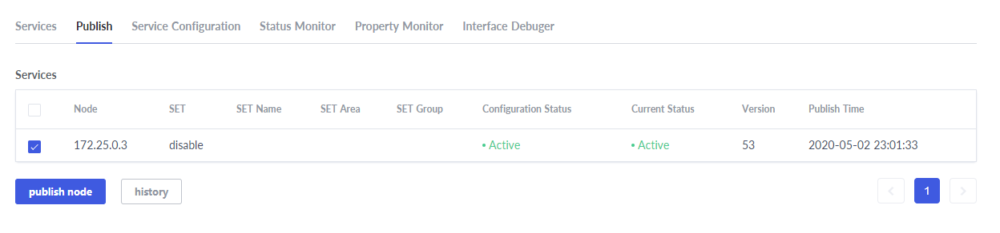
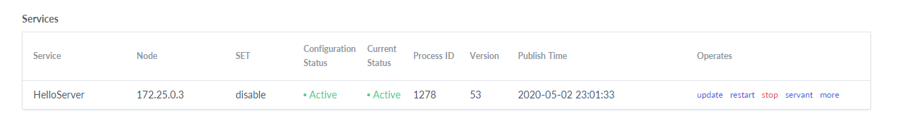
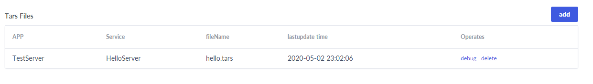

# Quick Start To Tars Server


## Tars deployment by Docker
### Docker installation
Taking Ubuntu for example, the installation process of docker is as follows:

**1. Update package index**

```text
sudo apt-get update
```

**2. Allow installation via HTTPS**

```
sudo apt-get install  apt-transport-https  ca-certificates curl  software-properties-common
```

**3. Add Docker's official GPG key**

```
curl -fsSL  https://download.docker.com/linux/ubuntu/gpg | sudo apt-key add
```

Chinese users can use ustc source:

```text
curl -fsSL  https://mirrors.ustc.edu.cn/docker-ce/linux/ubuntu/gpg | sudo apt-key add -
```

**4. Set version library type**

```
sudo add-apt-repository "deb [arch=amd64]  https://download.docker.com/linux/ubuntu $(lsb_release -cs) stable" 
```

Chinese users can use ustc source:

```text
sudo add-apt-repository "deb [arch=amd64] https://mirrors.ustc.edu.cn/docker-ce/linux/ubuntu $(lsb_release -cs) stable" 
```

**5.  Update package index again**

```text
sudo apt-get update
```

**6. Install Docker-ce** 

```
sudo apt-get install docker-ce
```

**7. Test whether the installation is successful** 

```
docker run hello-world
```


The above interface appears to indicate that docker has been installed successfully.


### Tars deployment

**1. Create a Docker virtual network**

```text
# Create a bridge virtual network named tars with a gateway of 172.25.0.1 and a network segment of 172.25.0.0
docker network create -d bridge --subnet=172.25.0.0/16 --gateway=172.25.0.1 tars
```

**2. Start MySQL in Docker**

```text
docker run -d \
    --net=tars \
    -e MYSQL_ROOT_PASSWORD="123456" \
    --ip="172.25.0.2" \
    -v /data/framework-mysql:/var/lib/mysql \
    -v /etc/localtime:/etc/localtime \
    --name=tars-mysql \
    mysql:5.6
```

**3. Deploy using tarscloud/tars:java image**

Pull the container image:

```text
docker pull tarscloud/tars:java
```

Start the container:

```text
docker run -d -it --name tars_java \
    --net=tars \
    --env DBIP=172.25.0.2 \
    --env DBPort=3306 \
    --env DBUser=root \
    --env DBPassword=123456 \
    -e INET=eth0 \
    --ip="172.25.0.3" \
    -p 3000:3000 \
    -p 18600-18700:18600-18700 \
    -v /data/tars_data:/data \
    tarscloud/tars:java
```

**Note: - P 18600-18700:18600-18700 parameter opens 18600-18700 port for application. You can add more ports if necessary**


After the container is started, access `http://${your_machine_IP}:3000` to open the web management platform. The interface is as follows:


## Server development

### Environmental requirements

- JDK1.8 or above
- Maven 2.2.1 or above
- Spring Boot 2.0 or above


### Project structure

```text
├── pom.xml
└── src
   └── main
       ├── java
       │   └── tars
       │       └── testapp
       │          ├── HelloServant.java
       │          ├── QuickStartApplication.java
       │          └── impl
       │                └── HelloServantImpl.java
       └── resources
           └── hello.tars
       
```


### Dependency configuration

The following configuration needs to be added in pom.xml:

**Spring boot and Tars framework dependency**

```xml
    <properties>
        <spring-boot.version>2.0.3.RELEASE</spring-boot.version>
    </properties>

    <dependencyManagement>
        <dependencies>
            <dependency>
                <groupId>org.springframework.boot</groupId>
                <artifactId>spring-boot-dependencies</artifactId>
                <version>${spring-boot.version}</version>
                <type>pom</type>
                <scope>import</scope>
            </dependency>
        </dependencies>
    </dependencyManagement>

    <dependencies>
        <dependency>
            <groupId>com.tencent.tars</groupId>
            <artifactId>tars-spring-boot-starter</artifactId>
            <version>1.7.0</version>
        </dependency>
    </dependencies>
```

**Plugin dependency**

```xml
<!--tars2java plugin-->
<plugin>
	<groupId>com.tencent.tars</groupId>
	<artifactId>tars-maven-plugin</artifactId>
	<version>1.7.0</version>
	<configuration>
		<tars2JavaConfig>
			<!-- tars file location -->
			<tarsFiles>
				<tarsFile>${basedir}/src/main/resources/hello.tars</tarsFile>
			</tarsFiles>
			<!-- Source file encoding -->
			<tarsFileCharset>UTF-8</tarsFileCharset>
			<!-- Generate server code -->
			<servant>true</servant>
			<!-- Generated source code encoding -->
			<charset>UTF-8</charset>
			<!-- Generated source code directory -->
			<srcPath>${basedir}/src/main/java</srcPath>
			<!-- Generated source code package prefix -->
			<packagePrefixName>com.qq.tars.quickstart.server.</packagePrefixName>
		</tars2JavaConfig>
	</configuration>
</plugin>
<!--package plugin-->
<plugin>
    <groupId>org.apache.maven.plugins</groupId>
    <artifactId>maven-jar-plugin</artifactId>
     <version>2.6</version>
     <configuration>
         <archive>
             <manifestEntries>
                 <Class-Path>conf/</Class-Path>
             </manifestEntries>
          </archive>
     </configuration>
</plugin>
<plugin>
    <groupId>org.springframework.boot</groupId>
    <artifactId>spring-boot-maven-plugin</artifactId>
    <configuration>
        <!--set mainclass-->
        <mainClass>com.qq.tars.quickstart.server.QuickStartApplication</mainClass>
    </configuration>
    <executions>
        <execution>
            <goals>
                <goal>repackage</goal>
             </goals>
     </executions>
</plugin>
```


### Service development

#### Tars interface file definition

Create a new hello.tars file in the resources directory with the following content:

```text
module TestApp
{
	interface Hello
	{
	    string hello(int no, string name);
	};
};
```

#### Interface file compilation

In the project root directory, execute mvn tars: tars2java to get HelloServant.java, the content is as follows:

```java
@Servant
public interface HelloServant {

	public String hello(int no, String name);
}
```

#### Interface implementation

Create a new HelloServantImpl.java file, implement the HelloServant.java interface, and expose the service through the @TarsServant annotation, where HelloObj is the servant name, corresponding to the web management platform.

```java
@TarsServant("HelloObj")
public class HelloServantImpl implements HelloServant {

    @Override
    public String hello(int no, String name) {
        return String.format("hello no=%s, name=%s, time=%s", no, name, System.currentTimeMillis());
    }
}
```

#### Tars service enabling

Add @EnableTarsServer annotation in the spring boot startup class QuickStartApplication to enable Tars service:

```java
@SpringBootApplication
@EnableTarsServer
public class QuickStartApplication {
    public static void main(String[] args) {
        SpringApplication.run(QuickStartApplication.class, args);
    }
}
```

#### Service packaging

通过spring-boot-maven-plugin，在根目录下执行mvn package即可打包为jar包。


## Service release

### Service deployment


Configure as shown above, some parameters are as follows:

- **Application Name**: a collection of services
- **Service Name**: the name of the process providing the service
- **OBJ**: interface which provides the specific service

The system defines the routing name of the service in the system through application name + service name + obj, for example, TestServer.HelloServer.HelloObj

- **Service type**: tars_java
- **Template**: tars.springboot
- **Node**: select the active tars node IP
- **Port**: choose open ports


### Node publication

After the service is successfully deployed, refresh the main page to see the newly added service:


Select the HelloServer service, switch to publish tag, select the node to publish, and click the publish node button:



Click the upload release package button, and upload the jar package:


After the upload is completed, a version number with a time stamp will be automatically generated. Select the version and click the publish button:


Back to the service management interface, you can see that the status is Active, which means success:




### Interface debugging

Switch to Interface Debugger tag，click the add button and upload the hello.tars file in the resources directory:


After the upload is completed, the newly added service will be displayed in the Tars file list. Click the debug button:



Select the function to be debugged, input the input parameter, and click the debug button to obtain the output parameter:


So far, the server deployment is complete.