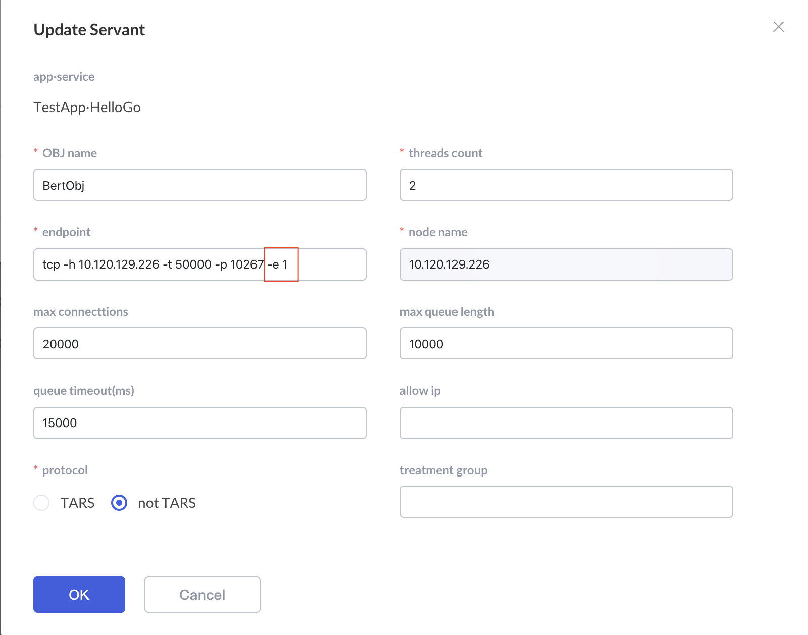
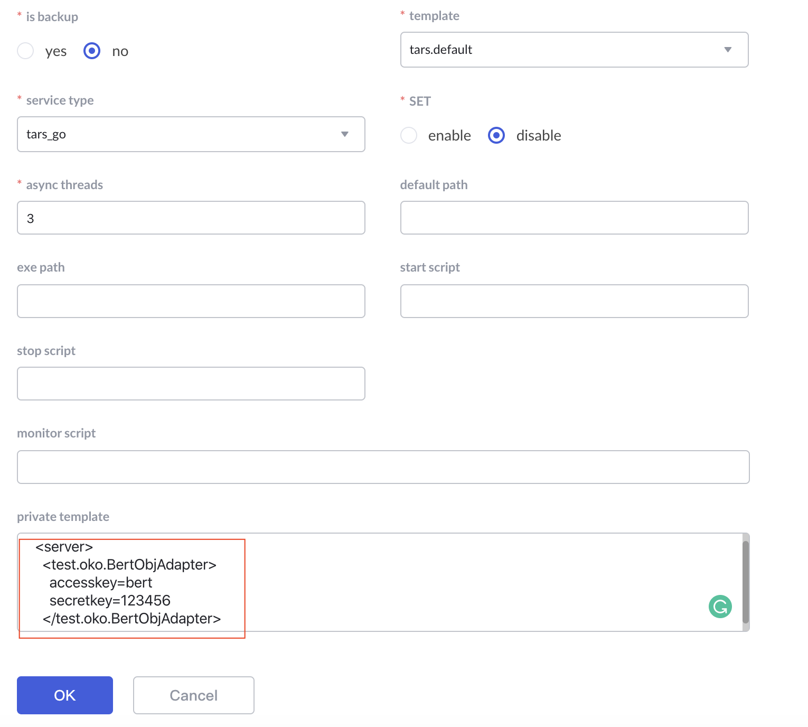
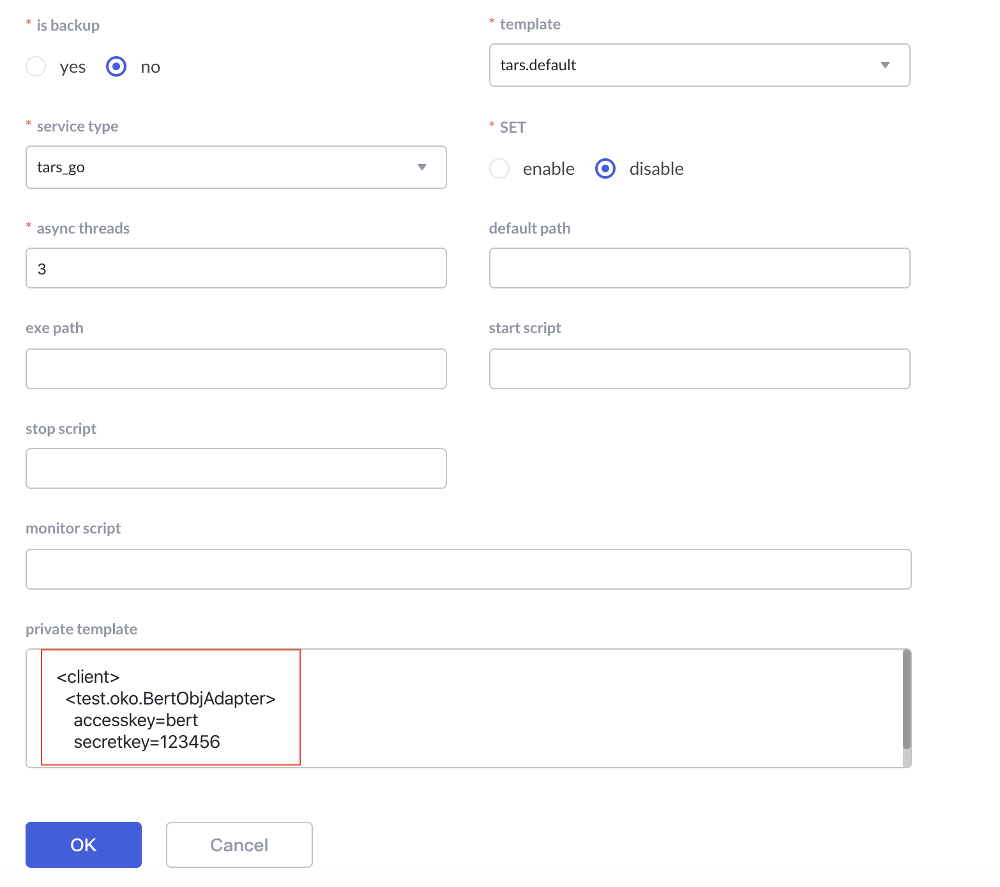

# Authentication

Tars is a powerful RPC framework. You only need to get the tars protocol file of the callee, and then you can use the tars framework to code and request the service of the callee. At the same time, it brings some security risks. If our service interface is sensitive, we don't want sensitive data to be accessed at will. In this way, we need an authentication access mechanism detailed to the service. Tars provides such a mechanism. You only need to set the account password. The tars framework automatically completes password verification at the network layer and is completely transparent to the business layer. If the client cannot provide the correct account password, the connection will be kicked directly.

At present, only C + + supports authentication, and Java will support it soon.

You can find demo: cpp/examples/AuthDemo.


## How to use 

The use of tar authentication is very simple. You don't need to modify one line of code, just change the configuration file. Just follow these three steps:

### Modify the endpoint of the server and enable the authentication mechanism

In the tars service platform, select the service to enable authentication, edit the service, modify the endpoint, add -e 1,  -e indicate whether authentication is enabled. If it is 0 by default, it is not enabled. If it is 1, it is enabled



### Modify the configuration file of the server to add the account password

Note that the server can have multiple adapters(ip port), and each adapter requiring authentication has its own account password. As shown in the figure, set the account Bert and password 123456 for test.oko.bertobjadapter



Due to incomplete screenshots, the actual private template content is as follows:

```text
<tars>
  <application>
    <server>
        <test.oko.BertObjAdapter>
            accesskey=bert
            secretkey=123456
        </test.oko.BertObjAdapter>
    </server>
  </application>
</tars>
```

Now, restart the service on the web platform.

### Modify the configuration file of the caller to add the account password

Note that the client can access multiple objs. Each obj that needs authentication has its own account password. As shown in the figure, set the account bert for test.oko.bertobj, password 123456:



Due to incomplete screenshots, the actual private template content is as follows:


```text
<tars>
  <application>
    <client>
        <test.oko.BertObj>
            accesskey=bert
            secretkey=123456
        </test.oko.BertObj>
    </client>
  </application>
</tars>
```

Now restart the caller on the web platform.

In this way, your service can only be accessed through the account password.

