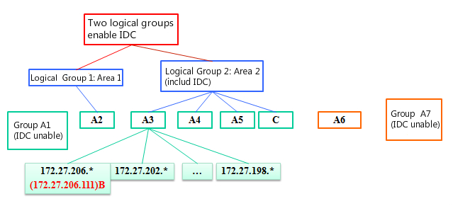
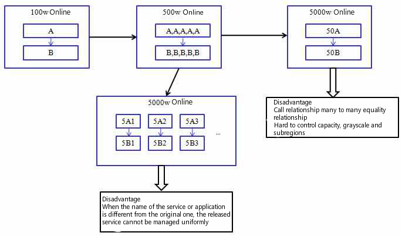
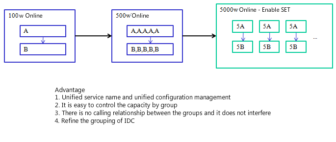

# Directory
> * [Group Intro](#main-chapter-1)
> * [IDC Group Intro](#main-chapter-2)
> * [Set Group Intro](#main-chapter-3)
> * [IDC and Set Group Call Rule](#main-chapter-4)

# 1. Group Intro 

When your cluster is on the scale, the server may be deployed in different computer rooms or network segments. In order to reduce cross network calls and ensure the priority of service calls of the same group, tars has designed a grouping mechanism.

At present, tars designs two groups: IDC group and set group
- IDC group simply said, through the IP network segment will automatically group servers
- Set group can group the server settings according to your settings

# 2. IDC Group Intro 

## 2.1. IDC Group

> * Locate the specific computer room according to the first three segments of IP address.
> * The information of which group the called service belongs to can be modified. If it is not specified, it will be matched according to the rules of the IP segment.

## 2.2. Change of group information

In the "service editing" of the management platform, it is changed by the operator and saved in the tars dB after the change. The main control Registry will read into its own cache every certain time.

## 2.3. Execution flow of grouping logic

The client will regularly take the information of the obj list from the registry. After receiving the request, the Registry will complete the core logic of IDC grouping.

The core process is as follows:
> * 1.First, all the active and inactive lists of the service are retrieved from the database
> * 2.Get the physical group of the caller according to the client IP, assuming as GROUP_A
> * 3.Traverse the activity list to retrieve all IP addresses belonging to GROUP_A. If found, return these IP addresses to the client and exit; otherwise, proceed to step 4.
> * 4.Traverse all logical groups according to the priority defined by table(t_group_priority). If the active IP is found in a logical group, return the IP to the client and exit; otherwise, find the next logical group. If the active IP is still not found in all logical groups, proceed to step 5.
> * 5.Traverse the "activity list" and it will belong to the group "-1", that is, retrieve the IP that has not started the group. If found, feed back these IP addresses to users. If not, go to step 6
> * 6.Returns the list of activities retrieved from the database directly.

## 2.4. Examples

Server A has seven services (A1,A2,A3,A4,A5,A6,A7) The deployment of IDC in each region is shown in the figure above。

Client B(ip:172.27.206.111) call server A: it can call A3

Client B call server A: it can call A3,A4,A5

Client B call server A: if A3,A4,A5 stoped, it can call A2

Client B call server A: if A3,A4,A5,A2 stoped，it can call A1,A7

Client B call server A: if A3,A4,A5,A2,A1,A7 stoped，it can callA6

> * The service has determined the physical and logical groups of the service.
> * The origin of the client can be modified, which will affect the activity list of the main call.
> * Whether to enable IDC grouping depends on the server !!!

# 3. Introduction to set grouping logic 

## 3.1. Meaning of set grouping

> * Set Name:  Define a large set name, which can be defined by application name.
> * Set Region：It can be divided by region, such as N, B (North and South), or by city, such as sh (Shanghai), SZ (Shenzhen), etc.
> * Set Group：The name of the group unit that can be repeated in practice, generally 0,1,2,3,4,5,…

## 3.2. Set Group Intro

Before set grouping, see the following figure:

After set grouping, see the following figure:

## 3.3. Call logic rules for set grouping

The following figure is an example:

The specific deployment is as follows:

Set Name |Set Region |Set Group | Server List
---------|-----------|----------|----
APP      |SZ         |1         |A,B,C,F
APP      |SZ         |2         |A,B,C
APP      |SZ         |\*(wildcard) |C,E,D,F 
APP      |SH         |1         |A,B,C
APP      |SH         |2         |A,B,C

1. A service calls B and C services, and the three services exist in both set groups 1 and 2. If B service in 1 dies, a will not call B service in 2, nor any B service in SH, but directly return empty set to a, because it is not in the same set.

2. As for C service, it exists in both 1, 2 set group and SZ region. If C in 1 is dead, it will neither call C in SZ region nor C in 2. Similarly, compared with F service, A service in 1 will never call f service in wildcard group.

3. For the a service in 2, the f service in the wildcard group can be called

4. D service can call any C service in SZ (including wildcard group and specific set service group)

5. For e service, C directly calls e service in the wildcard group

Call general principles:
> * 1. Set grouping shall be enabled for both the client and server, and the set full name shall be consistent
> * 2. Whenever servers (dead or alive) in set, only those in same set can be called. If it is not server  (dead is also counted) in same set with the client, only the public wildcard area can be called. If not, only the set not enabled can be called according to the IDC grouping principle.1A->1C, 1A can not ->*C, 1A->1F, 1A cannot ->*F, 2A->*F, C->E 
> * 3. The wildcard group service can call any service in the set and the generic group *D->*C+1C+2C
> * 4. If 1 is not met, it is called according to IDC grouping logic.

# 4. Call rules of IDC group and set group 

No | Client | Server | Rule
------|-----|------|----
1 | Open Set | Open Set | Find the IP address in the same set, and return empty if there is no available address in the same set
2 | Open Set | Not Open Set/ Open IDC |Address return address grouped by IDC 
3 | Open Set | Not Open Set/ Not Open IDC |Return all available addresses
4 | Not Open Set | Open Set/ Open IDC |Address return address grouped by IDC
5 | Not Open Set | Open Set/ Not Open IDC |Return all available addresses
6 | Not Open Set | Not Open Set/ Open IDC |Address return address grouped by IDC
7 | Not Open Set | Not Open Set/ Not Open IDC |Return all available addresses
