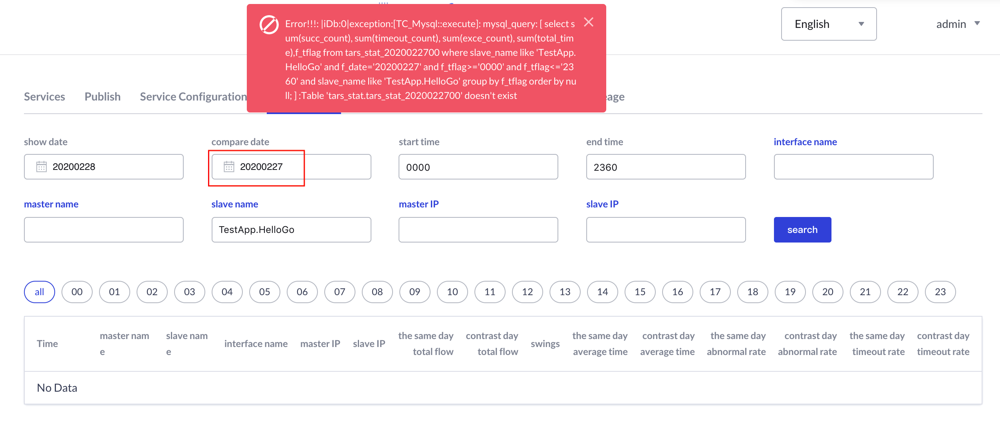

## 1. You can't deploy service on IP `127.0.0.1` for the following reasons:

1. each service has at least one obj to serve foreign clients;

2. each service has a obj for administration, it binds to ip `127.0.0.1` and the same port which servant obj binds to.

## 2. Tars consists of RPC framework, basic services, web management system, etc.

The RPC framework supports C++ , Java, Go, Php, Nodejs. Each language has its related baselib, idl generate-code tools, and implementation of client's and server's code, all can run on linux/mac/windows.

## 3. The software and tools that Tars depends must be prepared before deploy Tars, see [Install.md](https://github.com/TarsCloud/TarsDocs_en/blob/master/installation/source.md).

## 4. The steps of deploying Tars must follow the specified order described in [Install.md](https://github.com/TarsCloud/TarsDocs_en/blob/master/installation/source.md)

## 5. After executing of tars_start.sh, please execute command `ps -ef|grep tars` to check that the core service processes of Tars are alive, ie, tarsregistry, tarsAdminRegistry, tarsnode, tarsconfig and tarspatch.

## 6. The paths in which services deployed as below:
Log file path: `/usr/local/app/tars/app_log/${Application}/${ServiceName}/`, such as 
```
/usr/local/app/tars/app_log/Test/HelloServer/
```

Executable file path: `/usr/local/app/tars/tarsnode/data/${Application}.${ServiceName}/bin/`, such as 
```
/usr/local/app/tars/tarsnode/data/Test.HelloServer/bin/
```

Template config file path: `/usr/local/app/tars/tarsnode/data/${Application}.${ServiceName}/conf/`, such as 
```
/usr/local/app/tars/tarsnode/data/Test.HelloServer/conf/
```

Cache file path: `/usr/local/app/tars/tarsnode/data/${Application}.${ServiceName}/data/`, such as 
```
/usr/local/app/tars/tarsnode/data/Test.HelloServer/data/
```

## 7. How to check logs
For example, there will be a log file named `Test.HelloServer.log` in directory `/usr/local/app/tars/app_log/Test/HelloServer/`. If something failed, please check it.

## 8. When deploy java service, please select tars.tarsjava.default as template.


## 9. Check query conditon if you have problem with monitor data.



## 10. Update old version to support IPv6 (v1.6.0 or later), database update script

Execute the following update script，and make sure that the password od database is right
```
TarsFramework/sql/upgrade2IPv6.sh
```

## 11. tarsnode can not run java server: cannot execute java

Please restart tarsnode after install jdk

```
/usr/local/app/tars/tarsnode/util/start.sh
```
